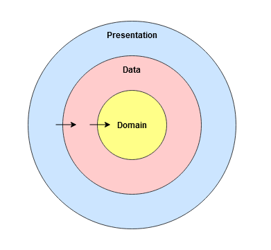
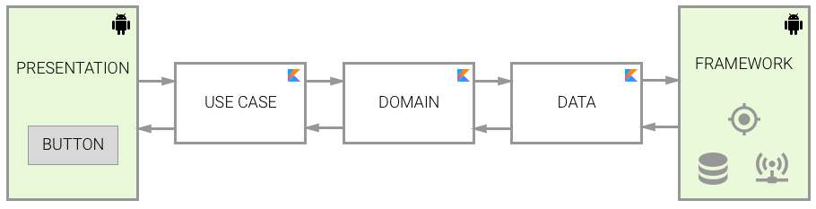
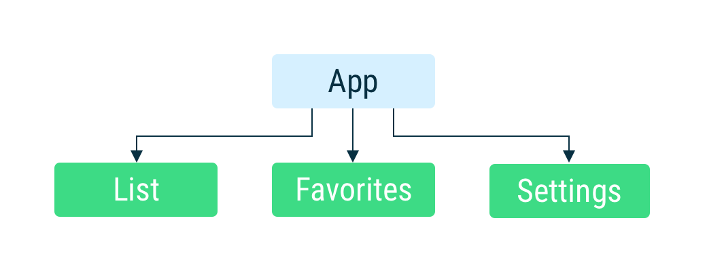
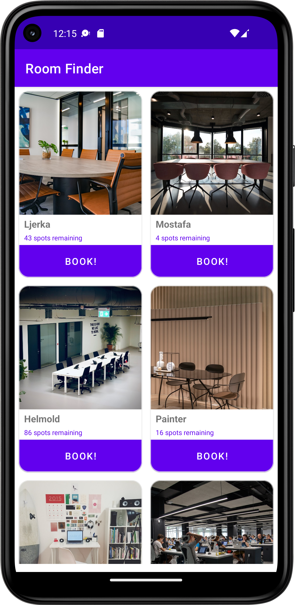
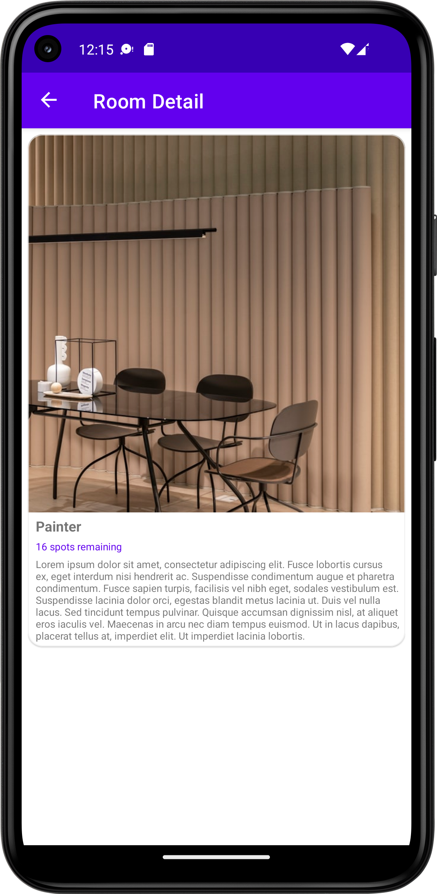

# Welcome to Room Finder!  
  
It's an app built using the MVVM, Repository Pattern and Clean Architecture. It uses the [RoomFinder API](https://wetransfer.github.io/rooms.json), displays all the rooms available in the office and lets the user book a room. 

 

## Index  
  
- [Key Features](#key-features)  
- [Architecture](#architecture)  
- [Testing Strategy](#testing-strategy)  
- [Screenshots](#screenshots)  
- [Libraries](#libraries)  
- [Future Enhancements](#future-enhancements)  
- [Installation Instructions](#installation-instructions)  
 

 

## Key Features  
1. **Separation of Concerns:** The app is built using Uncle Bob's clean architecture (see architecture section below)  
2. **Reusable feature modules:** Modern feature module design pattern is used so that in the future, the same modules can be used in other apps.  
3. **Scalable navigation architecture** Feature modules are independent of the app-level navigation implementation detail. Navigation architecture can be changed at any time without affecting the features.
  
  
  
 
  
## Architecture  
The app is built with scalability in mind. To maintain the separation of concerns, [Clean Architecture](https://blog.cleancoder.com/uncle-bob/2012/08/13/the-clean-architecture.html) by Robert C. Martin, is used. The diagram below shows how the clean architecture is mapped to this android application   
  

### Flow of control:  
Flow of control is one directional only. Any inner layer doesn't know about any layer outside of it. If an inner layer needs to communicate to an outer layer, it is done via Dependency Inversion.   
  
To maintain this separation over the course of time, separate android/kotlin modules can be used for each layer for bigger features.  
  
  
  
### Feature Modules  
  
The app has 2 feature modules:
  
- **Room List** - Shows a list of the rooms and allows the user to book a room.
- **Room Detail** - Shows the detailed description of a room.
  
Both of these feature modules are unaware of each other. Hence, they can be used independently in any app. 
  
### Navigation
  
The feature modules are unaware of the app-level navigation. App controls the navigation between each module. Currently, it uses Jetpack Navigation. But this can be changed at any time without affecting any feature module.

 

This is implemented as per [Google's recommendation](https://developer.android.com/guide/navigation/navigation-multi-module) for multi-module navigation. This allows us to have an independent navigation architecture in each feature module.
 
 
 
 
  
## Testing Strategy  
  
There are examples of 2 types of testing strategies in this project:

**1. Class level unit testing**
`RoomRepositoryImplTest` tests the class `RoomRepositoryImpl` using the conventional unit testing methodology commonly practised in the Android world. The unit under test here is the class and its methods. The API of the unit is the `RoomRepository` interface.

**2. Module level unit testing**
`RoomListViewModelTest` tests the class `RoomListViewModel` using the unit testing methodology as practised in TDD. The unit under test here is the room-list module (non-UI part). The API of the unit is the `RoomListViewModel` class.

This practice is not common in the Android community but it is very beneficial because it helps test the functionality of your modules, without testing the implementation details. Kent Beck, the creator of TDD and Uncle Bob, the co-founder of Agile Manifesto have some great articles on this topic.
  
### Testing Libraries:  
- **JUnit4** - Unit testing framework  
- **Mockk** - Creating test doubles
- **Google Truth** - For fluent, readable assertions  
- **Turbine** - For easier testing of Kotlin flows.  
  
 

  
## Screenshots  
  
 

 

## Libraries  
  
- **Material Design** - UI design  
- **AndroidX** - Fragments, ViewModel
- **KotlinX** - Coroutines, Flow, SharedFlow, Serialization  
- **Hilt** -  Dependency Injection  
- **Navigation Component** - User navigation  
- **Glide** - Loading Images  
- **Retrofit** - API Calls  

 
  
## Future Enhancements  
These are the enhancements that are important but were left because of time constraints:  
  
### Features
1. Consume the book room API.
2. Update spots left after booking.
3. Implement Room database behind the `LocalDataSource` for real caching.
4. Implement a cache strategy to refresh the cache data at regular intervals

### User Experience
1. Add a splash screen.
2. Swipe to refresh or a refresh button
3. Show loader when book room button is pressed. 
4. Show error if book room call fails
5. Allow booking from the details page
6. Add a details page button on the list items.
7. Search option on the list page.
8. Show warning when user tries to book second room.

### Testing  
1. Implement the remaining unit tests 
2. Write UI-level integration tests
  

  
### Other  
  
1. Create a retrofit adapter for network error handling that is currently in the `NetworkError` class.
2. Refresh and search features on Home Screen.
3. Clean up unused resources.

 

  
## Installation Instructions  
Please use Android Studio (preferably Chipmunk or newer) and JDK 11 to run the app.
